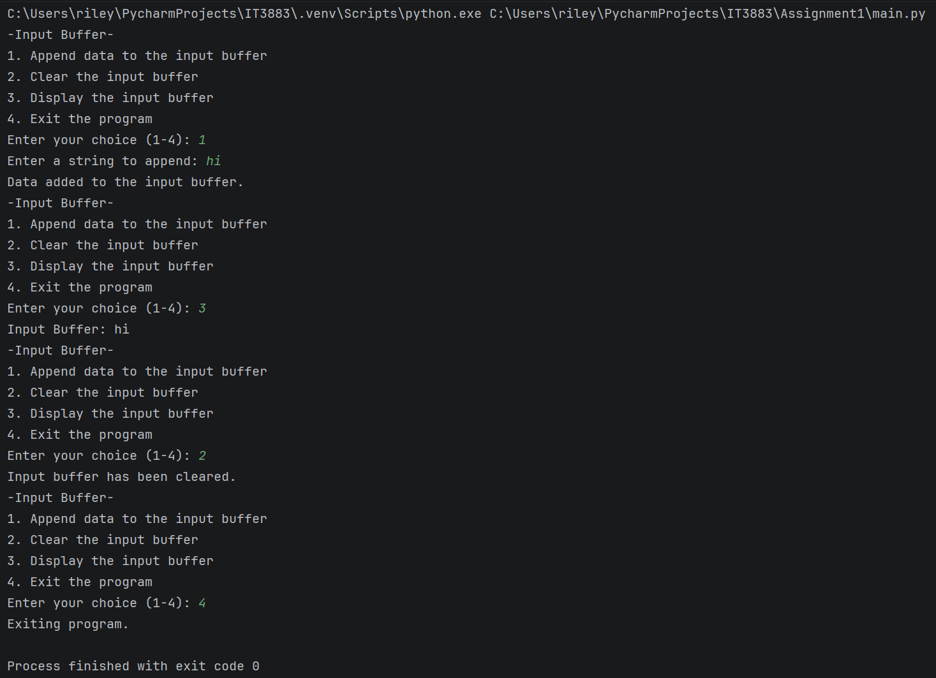

# Assignment 1
# About
### Program Name: main.py (use the name the program is saved as)
### Course: IT3883/Section 01
### Student Name: Riley Dunevent
### Assignment Number: Assignment Number 1
### Due Date: 09/21/ 2026
### Purpose: What does the program do (in a few sentences)?:
### The program prints a menue out with 4 options. Three of those options lets the user add text, clear it, or display it from the input buffer. The 4th option being exit the program.

### List Specific resources used to complete the assignment.:
### I used the class D2L notes and W3 schools pyton material for stuff I was confused about still.
## Screenshot
