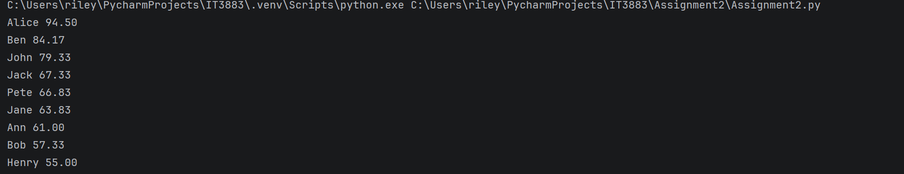

# Assignment2
# About
### Program Name: Assignment2.py
### Course: IT3883/Section 01
### Student Name: Riley Dunevent
### Assignment Number: Assignment Number 1
### Due Date: 09/21/ 2026
### Purpose: What does the program do?:
### It reads the students scores from the document. It then calculates the student averages and print them highest to lowest.

### List Specific resources used to complete the assignment.:
### I used the class D2L notes and W3 schools pyton material for sorting that I was confused about.
## Screenshot
