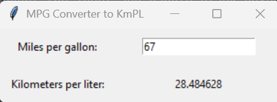

# Assignment3
# About
### Program Name: Assignment3.py
### Course: IT3883/Section 01
### Student Name: Riley Dunevent
### Assignment Number: Assignment Number 3
### Due Date: 10/10/ 2026
### Purpose: What does the program do?:
### Convert miles per gallon to kilometers per liter.

### List Specific resources used to complete the assignment.:
### I used the class D2L notes and examples from D2L. I also used W3 schools pyton material to help with this assignment.
## Screenshot
